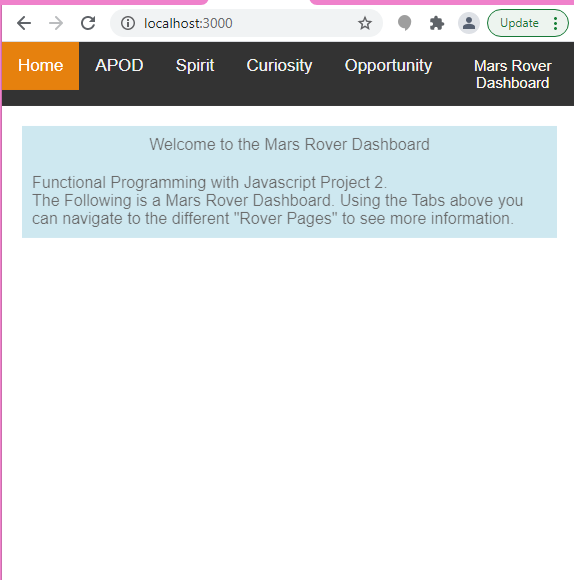
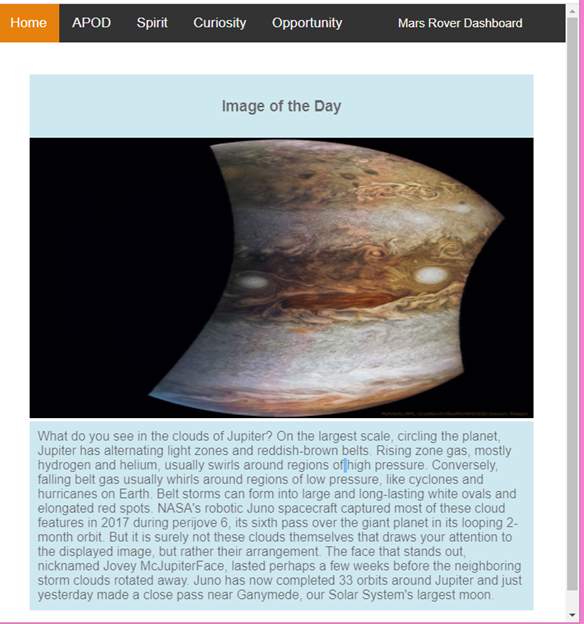

# project2-mars-rover

Mars Rover Project 2

This project consumes NASA's API to display photos/info on the various Mar Rovers.

- [NASA API](https://api.nasa.gov/)


# Steps to Run the project

## Clone Project
- Clone the github repo for this project onto your local machine

```bash 
git clone https://github.com/fictiveUniverse/project2-mars-rover.git
```


## NPM
- For this project we are using npm
- Packages needed for NPM are pre-installed and added to this git repo 

- Change Directory to the following path: 

```bash 
cd project2-mars-rover/project/src/server
```

- Run the following command
-  
```bash
npm start
```

You should see a similar output: 

```bash 
> jsnd3_mars_dashboard@1.0.0 start C:\Users\Priyal\Documents\Udacity\test-submission\project2-mars-rover\project
> node src/server/index.js

Example app listening on port 3000!
```

## Launch the App in a Browser

- Open your browser and set the browser address to `localhost:3000` and `enter`

- Should see a page that looks like 



- From here you can navigate to the different pages by using the top Navigation Bar. 

- For example if you click on APOD, the site will bring you to the following: 


